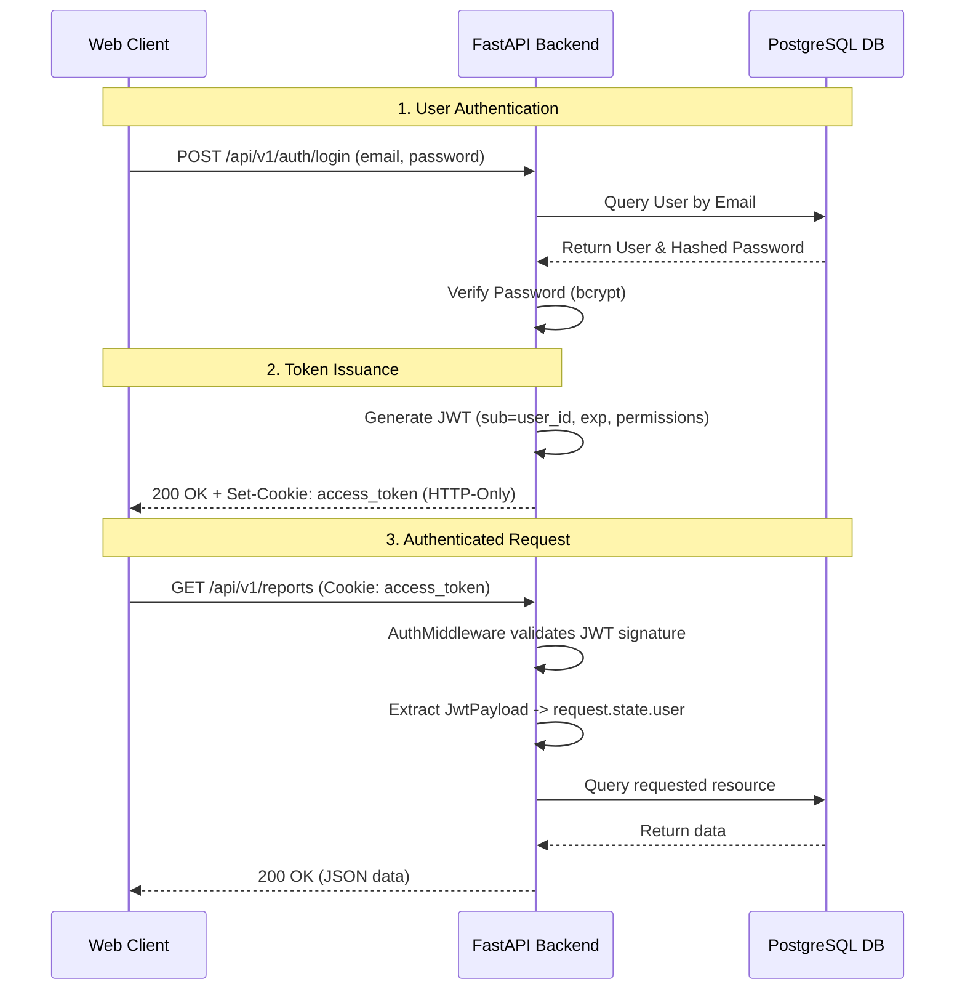

# Authentication & Authorization Runbook

## 1. Executive Summary & Purpose
This document outlines the authentication and authorization flow for the **Weekly Report Generator & Team Dashboard**. The application uses a stateless, JWT-based authentication mechanism. JSON Web Tokens (JWTs) are issued upon successful login or registration and are securely transported via `HTTP-Only` cookies to protect against Cross-Site Scripting (XSS) attacks. 

Role-Based Access Control (RBAC) ensures users (Team Members, Managers, Admins) only access their authorized endpoints.

---

## 2. Architecture Overview

The system employs a client-server architecture where the frontend client requests authentication from the FastAPI backend. Once authenticated, the server drops an HTTP-only cookie onto the client.

### Authentication Flow Diagram



### Component Definitions
- **Identity Store:** PostgreSQL (`users`, `roles`, `permissions`, `user_roles`, `role_permissions` tables).
- **Token Issuer / Verifier:** PyJWT library handling HMAC (HS256) symmetric signatures.
- **Middleware:** `AuthMiddleware` intercepts all requests, extracts the token from the cookie, verifies it, and attaches user context.

---

## 3. Operational Workflow & API Usage

### 3.1. Registration (Sign Up)
Registers a new user and automatically assigns the `TEAM_MEMBER` role.

**Request:**
```bash
curl -X POST "http://localhost:8000/api/v1/auth/signup" \
     -H "Content-Type: application/json" \
     -d '{"user_email": "jane@example.com", "password": "securepassword", "full_name": "Jane Doe"}'
```

**Expected Response (200 OK):**
```json
{
  "sub": "550e8400-e29b-41d4-a716-446655440000",
  "exp": 1735689600,
  "permissions": []
}
```
*Note: A `Set-Cookie: access_token=...; HttpOnly; Path=/; SameSite=Lax` header is included in the response.*

### 3.2. Authentication (Log In)
Authenticates a user and establishes a session cookie.

**Request:**
```bash
curl -X POST "http://localhost:8000/api/v1/auth/login" \
     -H "Content-Type: application/json" \
     -d '{"user_email": "jane@example.com", "password": "securepassword"}'
```

**Expected Response (200 OK):**
```json
{
  "sub": "550e8400-e29b-41d4-a716-446655440000",
  "exp": 1735689600,
  "permissions": ["CREATE_REPORT", "VIEW_OWN_REPORT"]
}
```

### 3.3. Log Out
Invalidates the session by instructing the browser to delete the authentication cookie.

**Request:**
```bash
curl -X POST "http://localhost:8000/api/v1/auth/logout"
```

---

## 4. Security & Maintenance Guardrails

- **Token Expiration**: Access tokens are configured to expire in 24 hours (`ACCESS_TOKEN_EXPIRE_MINUTES = 1440`). Upon expiration, the client receives a `401 Unauthorized` and must re-authenticate.
- **Password Hashing**: Passwords are mathematically hashed using `bcrypt` (via `passlib`) before persistence. Raw passwords are never stored.
- **Secret Management**: The JWT signing key (`SECRET_KEY`) must be a strong, unpredictable cryptographic string, loaded entirely from the `.env` configuration file. Do not hardcode secrets into the source code.
- **Cookie Security Options**: 
  - `HttpOnly`: **True** (Mitigates XSS attacks by restricting JS access).
  - `SameSite`: **Lax** (Prevents CSRF on cross-origin POST requests).
  - `Secure`: **True** (Required in production; ensures cookies are only sent over HTTPS).

### Error Remediation Codes
| Status Code | Message | Cause & Remediation |
|-------------|---------|---------------------|
| `400` | Email already registered | User attempted to sign up with an existing email. Direct user to login. |
| `401` | Invalid email or password | Incorrect credentials. Advise user to try again. |
| `401` | Token expired / invalid | The JWT signature failed or expired. Force a new login cycle. |
| `403` | Forbidden | User authenticated successfully but lacks the specific `Permission` to access the endpoint. |
